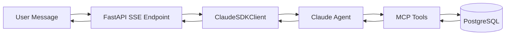

# AI Agent

## Overview

The AI agent is built on the **Claude Agent SDK** and provides a conversational interface for exploring CaRMS programs. It uses custom MCP (Model Context Protocol) tools to query the database and provide informed responses.

## Architecture



## Available Tools

| Tool | Description |
|------|-------------|
| `search_programs` | Semantic search using natural language queries |
| `filter_programs` | Structured filtering by discipline, school, site, stream |
| `get_program_detail` | Full program information with all description sections |
| `compare_programs` | Side-by-side comparison of multiple programs |
| `list_disciplines` | All 37 disciplines with program counts |
| `list_schools` | All schools with program counts |
| `get_analytics` | Aggregate statistics about the program landscape |

## Configuration

Set `ANTHROPIC_API_KEY` in your `.env` file to enable the agent:

```bash
ANTHROPIC_API_KEY=sk-ant-your-key-here
```

Without the key, the REST API and dashboard still work - only the chat agent requires it.

## Session Management

Each chat session maintains conversation context via `ClaudeSDKClient`. Sessions are identified by a `session_id` and persist across multiple messages. The agent remembers previous queries and can build on earlier responses.
