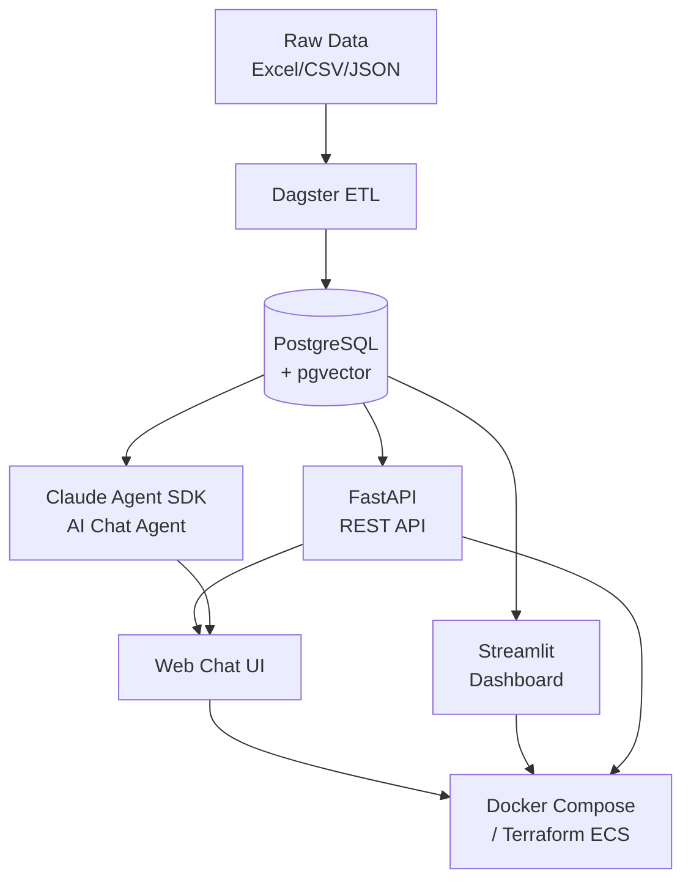

# Architecture

## System Overview

## Services

| Service | Port | Description |
|---------|------|-------------|
| FastAPI | 8000 | REST API + Chat UI (root `/`) + Swagger docs (`/docs`) |
| Dagster | 3000 | ETL pipeline orchestration UI |
| Streamlit | 8501 | Analytics dashboard |
| MkDocs | 8080 | Documentation |
| PostgreSQL | 5432 | Database with pgvector extension |

## Two Modes

### Core Platform (no API key required)
- REST API with full CRUD and semantic search
- Streamlit analytics dashboard
- All powered by local embeddings (all-MiniLM-L6-v2)

### AI Agent (with ANTHROPIC_API_KEY)
- Conversational chat interface
- Natural language program discovery
- Tool-augmented responses (search, filter, compare)
- Built on Claude Agent SDK with custom MCP tools
