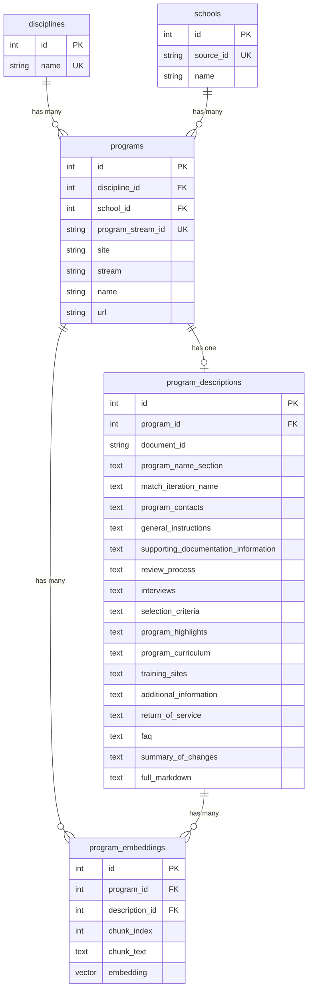

# Data Model

## Entity Relationship Diagram

```mermaid
erDiagram
    disciplines ||--o{ programs : "has many"
    schools ||--o{ programs : "has many"
    programs ||--o| program_descriptions : "has one"
    programs ||--o{ program_embeddings : "has many"
    program_descriptions ||--o{ program_embeddings : "has many"

    disciplines {
        int id PK
        string name UK
    }

    schools {
        int id PK
        string source_id UK
        string name
    }

    programs {
        int id PK
        int discipline_id FK
        int school_id FK
        string program_stream_id UK
        string site
        string stream
        string name
        string url
    }

    program_descriptions {
        int id PK
        int program_id FK
        string document_id
        text program_name_section
        text match_iteration_name
        text program_contacts
        text general_instructions
        text supporting_documentation_information
        text review_process
        text interviews
        text selection_criteria
        text program_highlights
        text program_curriculum
        text training_sites
        text additional_information
        text return_of_service
        text faq
        text summary_of_changes
        text full_markdown
    }

    program_embeddings {
        int id PK
        int program_id FK
        int description_id FK
        int chunk_index
        text chunk_text
        vector embedding
    }
```

## Key Numbers

- **37** disciplines
- **815** programs
- **17** schools
- **~8,000+** embedding chunks (varies with chunk size)
