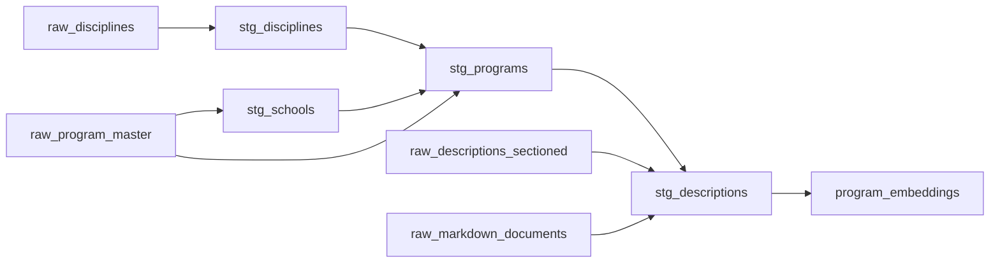

# ETL Pipeline

## Dagster Asset Graph



## Assets

### Raw Layer
- `raw_disciplines` - Loads `1503_discipline.xlsx` (37 rows)
- `raw_program_master` - Loads `1503_program_master.xlsx` (815 rows)
- `raw_descriptions_sectioned` - Loads `1503_program_descriptions_x_section.csv` (815 rows, 15 section columns)
- `raw_markdown_documents` - Loads `1503_markdown_program_descriptions_v2.json` (815 LangChain documents)

### Staging Layer
- `stg_disciplines` - Upserts into `disciplines` table
- `stg_schools` - Extracts unique schools from program master, upserts into `schools` table
- `stg_programs` - Upserts programs with FK lookups for discipline and school
- `stg_descriptions` - Merges sectioned CSV columns with full markdown documents

### Embedding Layer
- `program_embeddings` - Chunks descriptions with `RecursiveCharacterTextSplitter`, generates embeddings with `all-MiniLM-L6-v2`, inserts with HNSW cosine index

## Running the Pipeline

1. Open Dagster UI at `http://localhost:3000`
2. Navigate to Assets
3. Click "Materialize All"
4. Monitor progress in the run viewer

Or trigger via the Dagster CLI:
```bash
dagster job execute -j full_refresh
```
